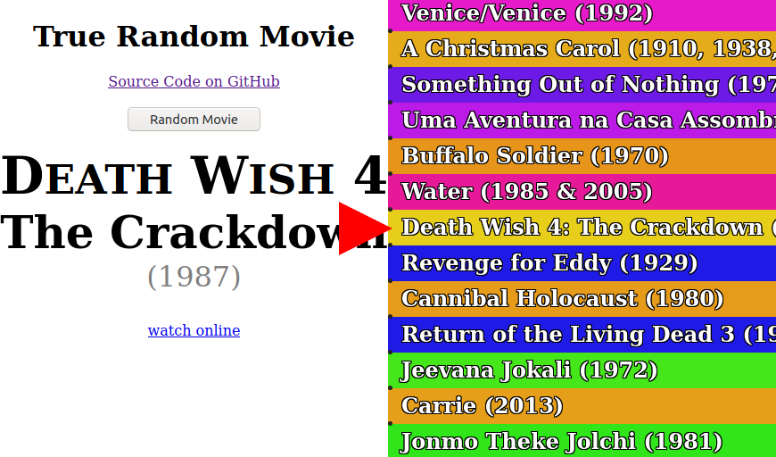

#  [True Random Movie][app]

Play movie reel roulette with over 32 thousand titles. 

Find movies that you would never watch otherwise.

## [▶ Launch the web app and 💫 Spin away! ◀][app]

[][app]

## Features

- Data set of over thirty two thousand movie titles
- List wraps seamlessly if you can manage to get to the end of it
- Good spinner physics, where the pegs affect the ticker and the ticker affects the pegs, and the pegs 
- Mobile friendly
- Browser history integration - the movie you spin to is included in the URL so you can go back with your browser's back button
- "watch online" link to quickly do a web search for a movie (often you can find a site to it for free easily)

## Data Sources

### Wikipedia
I copied from [Wikipedia's alphabetical lists of movies](https://en.wikipedia.org/wiki/Lists_of_films#Alphabetical_indices).
I made many edits to normalize the data, and then contributed back to wikipedia, for which someone awarded me The Copyeditor's Barnstar 😊

## Development Setup

- [Clone the repo.][git clone]
- Open up a command prompt / terminal in the project directory.
- Start a webserver, such as [live-server][] (`npx live-server` if you have Node.js)

[git clone]: https://help.github.com/articles/cloning-a-repository/
[live-server]: https://www.npmjs.com/package/live-server
[app]: https://1j01.github.io/true-random-movie/
