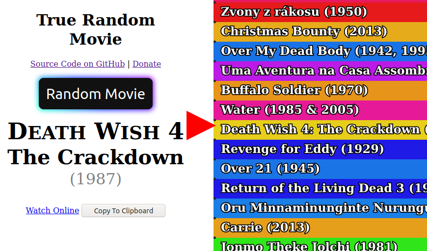

#  [True Random Movie][app]

Play movie reel roulette with over 32 thousand titles. 

Find movies that you would never watch otherwise.

## [▶ Launch the web app and 💫 Spin away! ◀][app]

[][app]

## Features

- Data set of over thirty two thousand movie titles
- List wraps seamlessly if you can manage to get to the end of it
- Good spinner physics, where the pegs affect the ticker and the ticker affects the pegs, and the pegs 
- Mobile friendly
- Browser history integration - the movie you spin to is included in the URL so you can go back with your browser's back button
- "Watch Online" link to quickly do a web search for a movie (often you can find a site to it for free easily)
- Ctrl+F to filter the films list by title

## Data Sources

### Wikipedia
I copied from [Wikipedia's alphabetical lists of movies](https://en.wikipedia.org/wiki/Lists_of_films#Alphabetical_indices).
I made many edits to normalize the data, and then contributed back to wikipedia, for which someone awarded me The Copyeditor's Barnstar 😊

## Development Setup

- [Clone the repo.][git clone]
- Open up a command prompt / terminal in the project directory.
- Start a webserver, such as [live-server][] (`npx live-server` if you have Node.js)

## Alternative Names

- Unseen Cinema
- True Random Movie - relaying relative randomness
- Mega Movie Spinner
- The Watch Whatever Wheel
- Cinema Spin'em'up
- Hipster Film Wheel
- FlickPick
- QuickFlickPick
- McQuickFlickPick
- QuickFlickPicky McQuickFlickPickFace
- Cinemascape / Moviescape - it can give you an overview of the landscape of film, but only thru titles and watching them
- Reely Random - relaying relative randomness
- Vast Cast Spinner - doesn't relate to cinema, but that could be a positive if I make it more general, let you paste in custom lists etc.
- Spinema
- Random All Movies
- Randy's Choice Movies or whatever
- Wheel of Film
- Wheel of Film-Turn - awkward punning
- Reel of Fortune
- Reel Wheel
- Randoreel
- FlickSelect
- Reely Random - relaying relative randomness
- Spin the Reel
- CinemaSampler - sounds more fitting for movie collage generator
- The Ultimate Film Picker of Eternity
- CinemaSelect (sounds like a terrible "club" / movie rewards card)
- Capricious Celluloid
- Strange Movie Picker
- Unusual Film Finder
- Box of Chocolates - unclear
- Film Alethiometer - obscure reference
- SpinCine - how to pronounce?
- MovieMovieMovieMovieMovie / FilmFilmFilmFilmFilmFilmFilm
- Movieverywhere / Movieverysingleone
- Bursting at the Scenes wif mooVVVVVV 4 u
- (could maybe do something like "I Don't Want To Think About What To Watch", some sort of sentence or expression of the scenario you'd want to use it)

building blocks:
- Film / Flick / Movie / Reel / Cinema / Watch / Silver Screen  
- Random / Generate / Pick / Select / Choose / Any / All / Every / Spinner / Wheel / Dice

[git clone]: https://help.github.com/articles/cloning-a-repository/
[live-server]: https://www.npmjs.com/package/live-server
[app]: https://1j01.github.io/true-random-movie/
